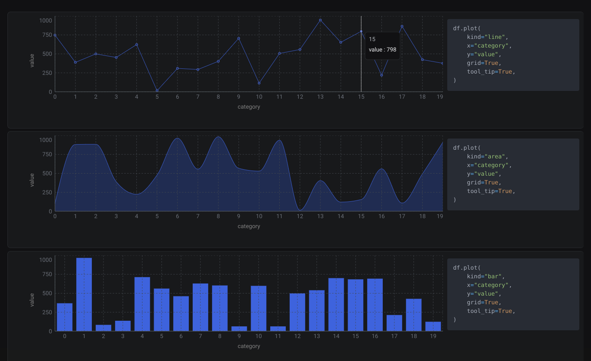

# reflex-plot
Seamlessly plot dataframes in _Reflex_ just like you would do with Matplotlib.



You can import `plot` from `reflex_plot` to get a Rechart component.

```python
import random
from typing import Literal

import pandas as pd
import reflex as rx
from reflex_plot import plot

def plot_data(kind: Literal["line", "area", "bar"]) -> rx.Component:
    df = pd.DataFrame(
        {
            "category": list(range(20)),
            "value": [random.randint(0, 1000) for _ in range(20)],
        }
    )
    return plot(
        df,
        kind=kind,
        x="category",
        y="value",
        grid=True,
        tool_tip=True,
    )
```

## Pandas plotting backend

You can also set `reflex_plot` as the default backend for pandas and use `DataFrame.plot` as you would do with Matplotlib


```python
pd.set_option("plotting.backend", "reflex_plot")


def plot_data(kind: Literal["line", "area", "bar"]) -> rx.Component:
    df = pd.DataFrame(
        {
            "category": list(range(20)),
            "value": [random.randint(0, 1000) for _ in range(20)],
        }
    )
    return df.plot(
        kind=kind,
        x="category",
        y="value",
        grid=True,
        tool_tip=True,
    )

```

## How to install
```
pip install reflex-plot
```

## Charts type covered
- [x] Line
- [x] Area
- [x] Bar
